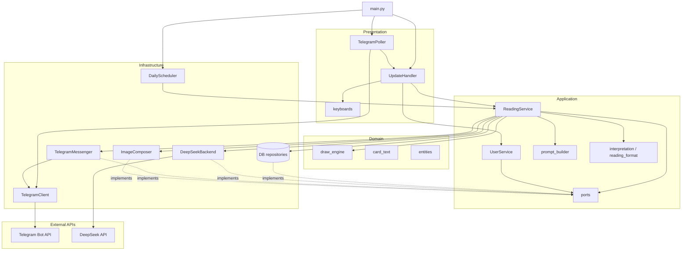
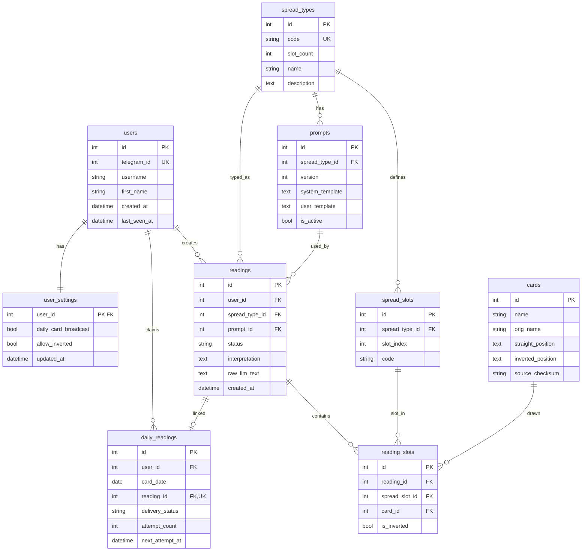

# Nord Tarot Bot

Telegram-бот для таро-раскладов с интерпретацией через DeepSeek API.

**Бот:** [@NordTarotBot](https://t.me/NordTarotBot)

## Возможности

- **1 карта** — разовый расклад на одну карту
- **3 карты** — расклад «Было — стало — будет»
- **Карта дня** — одна карта на пользователя в сутки; повторное нажатие возвращает уже сохранённый результат
- **Параметры** — авторассылка карты дня в полночь, включение/выключение перевёрнутых карт
- Отправка **склейки картинок** (Pillow) и **текста толкования** с жирным заголовком (название + положение)
- Индикатор ожидания («🔮 Толкую…») во время генерации

## Стек

| Слой | Технология |
|------|------------|
| Язык | Python 3.12, asyncio |
| Telegram | Bot API через `httpx` |
| LLM | DeepSeek (`aiohttp`) |
| БД | SQLite + SQLAlchemy async + Alembic |
| Изображения | Pillow |
| Логи | `logging` + `structlog` |
| Тесты / качество | pytest, ruff, bandit, vulture |

## Структура проекта

```
tarot/
├── src/
│   ├── main.py                 # точка входа
│   ├── core/settings/          # конфиг, константы, логирование
│   ├── domain/                 # движок вытягивания, тексты карт
│   ├── application/            # use cases, порты, промпты, постобработка
│   ├── infrastructure/         # БД, LLM, Telegram, imaging, scheduler
│   └── presentation/           # poller, handlers, клавиатуры
├── tests/
├── scripts/quality/            # run_gates.py
├── scripts/docker/             # entrypoint для контейнера
├── images/                     # JPG карт 0–77
├── tarot_cards.csv
├── Dockerfile
├── docker-compose.yml
└── .env
```

Архитектура слоистая: `application` не импортирует `infrastructure` и `presentation`. Сборка зависимостей — в `src/main.py`.

## Архитектура

Зависимости направлены **внутрь**: `presentation` → `application` → `domain`. Слой `infrastructure` реализует порты (`ports.py`), объявленные в `application`. Точка сборки — `src/main.py`.



### Поток обработки расклада

1. **Poller** получает update → **UpdateHandler** открывает `session_scope`.
2. **UserService** регистрирует/обновляет пользователя; **ReadingService** вытягивает карты (`draw_engine`).
3. Для «карты дня» — атомарный `claim_daily` (уникальность `user_id + card_date`).
4. Собирается промпт → запрос в **DeepSeek** → постобработка текста.
5. **ImageComposer** склеивает JPG → **Messenger** отправляет фото и HTML-текст.

Параллельно **DailyScheduler** в полночь создаёт карты дня для пользователей с `daily_card_broadcast` и доставляет отложенные рассылки.

## Модель базы данных

Схема в **3НФ**: справочники карт и типов раскладов отделены от экземпляров раскладов; позиции карт в раскладе — через `spread_slots` + `reading_slots` (без дублирования имён слотов в каждом reading).



### Таблицы и связи

| Таблица | Назначение |
|---------|------------|
| `users` | Пользователи Telegram (`telegram_id` уникален) |
| `user_settings` | Настройки: авторассылка карты дня, перевёрнутые карты |
| `cards` | Справочник 78 карт (сид из `tarot_cards.csv`) |
| `spread_types` | Типы раскладов: `single`, `three`, `daily` |
| `spread_slots` | Слоты расклада: `T1`, `PAST`, `PRESENT`, `FUTURE` |
| `prompts` | Шаблоны промптов LLM (один активный на тип расклада) |
| `readings` | Экземпляр расклада + статус и текст толкования |
| `reading_slots` | Какая карта выпала в каком слоте и ориентация |
| `daily_readings` | Привязка «карта дня» к дате; `UNIQUE(user_id, card_date)` |

### Ключевые ограничения

- **`daily_readings`**: один reading на пользователя в сутки; `reading_id` тоже уникален (1:1 с reading).
- **`reading_slots`**: уникальная пара `(reading_id, spread_slot_id)` — в каждом слоте не больше одной карты.
- **`spread_slots`**: уникальные `(spread_type_id, slot_index)` и `(spread_type_id, code)`.
- **`prompts`**: partial unique index — только один `is_active = 1` на `spread_type_id`.
- **`readings.status`**: `pending` → `completed` / `failed`.
- **`daily_readings.delivery_status`**: `none`, `pending`, `sent`, `failed` (очередь авторассылки).

Статические данные (`cards`, `spread_types`, `spread_slots`, `prompts`) заполняются при старте через `seed_database()`. Пользовательские данные — через use cases в `ReadingService` / `UserService`.

## Быстрый старт (локально)

### 1. Окружение

```powershell
cd P:\tarot
python -m venv .venv
.\.venv\Scripts\Activate.ps1
pip install -r requirements.txt
pip install -r requirements-dev.txt
```

### 2. Конфигурация

Скопируйте `.env.example` в `.env` и заполните обязательные переменные:

| Переменная | Обязательно | Описание |
|------------|-------------|----------|
| `TELEGRAM_BOT_TOKEN` | да | Токен бота от [@BotFather](https://t.me/BotFather) |
| `DEEPSEEK_API_KEY` | да | API-ключ DeepSeek |
| `TELEGRAM_PROXY_URL` | нет | HTTP(S)-прокси для Telegram API |
| `GENERATION_SERVER_URL` | нет | Базовый URL LLM (по умолчанию `https://api.deepseek.com`) |
| `LLM_MODEL_NAME` | нет | Модель (по умолчанию `deepseek-v4-flash`) |
| `DB_PATH` | нет | Путь к SQLite (по умолчанию `tarot.db`) |
| `TIMEZONE` | нет | Часовой пояс для «карты дня» (по умолчанию `Europe/Moscow`) |

### 3. Запуск

```powershell
$env:PYTHONPATH='P:\tarot'
python -m alembic upgrade head
python src/main.py
```

При старте выполняются миграции, сидирование карт из CSV и промптов, затем long-poll Telegram и планировщик карты дня.

## Docker

```powershell
cd P:\tarot
docker compose up --build -d    # сборка и запуск
docker compose logs -f bot      # логи
docker compose restart bot      # перезапуск
docker compose down             # остановка
```

- Секреты берутся из `.env` (`env_file` в `docker-compose.yml`).
- База данных хранится в volume `tarot_tarot-data` (`/data/tarot.db` внутри контейнера).
- Локальный `tarot.db` и Docker-volume — **разные** базы; для переноса данных нужно скопировать файл в volume или смонтировать его явно.

## Разработка

### Тесты

```powershell
$env:PYTHONPATH='P:\tarot'
pytest tests -q
pytest tests/test_interpretation.py -q
```

### Проверки перед релизом

```powershell
python scripts/quality/run_gates.py
```

Или по отдельности:

```powershell
ruff check src tests scripts
ruff format --check .
bandit -r src -c .bandit
vulture src --min-confidence 80
pytest tests -q
alembic upgrade head
```

### Smoke-тест (токен + getMe)

```powershell
$env:PYTHONPATH='P:\tarot'
python scripts/smoke_startup.py
```

## Поведение бота

| Действие | Результат |
|----------|-----------|
| `/start` | Главное меню с кнопками |
| «1 карта» | Новый расклад на 1 карту |
| «3 карты» | Расклад PAST / PRESENT / FUTURE |
| «Карта дня» | Одна карта на текущие сутки; повтор — тот же ответ |
| «Параметры» | Авторассылка карты дня, перевёрнутые карты |

Текст ответа: жирный заголовок с названием и положением карты, затем абзацы толкования (HTML, без markdown от LLM).

## Полезные замечания

- Не коммитьте `.env`, `*.db` и содержимое `tmp/` — они в `.gitignore`.
- Карты в `images/` — исходные ассеты; временные композиты пишутся в `tmp/`.
- При недоступности Telegram API poller повторяет запросы, а не падает сразу.
- Подробности для агентов/IDE — в [AGENTS.md](AGENTS.md).
