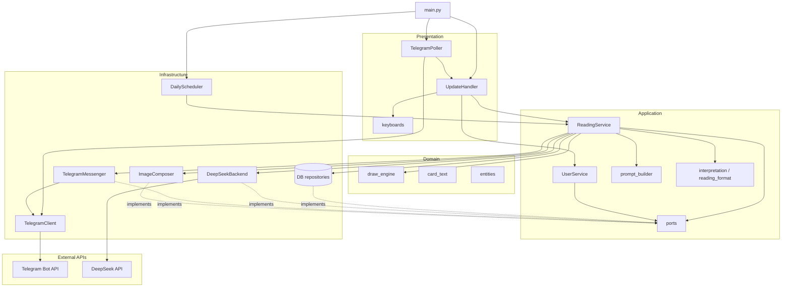
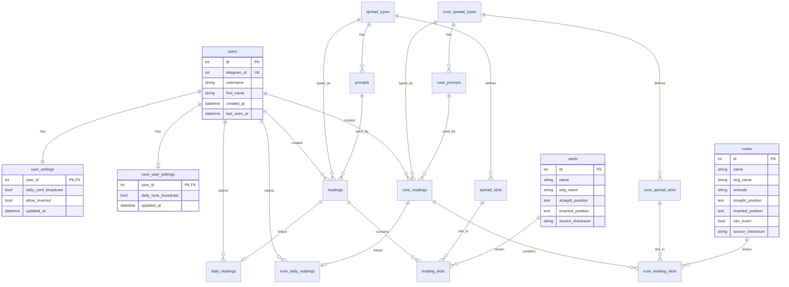

# Nord Tarot Bot

Telegram-боты для таро и рун с интерпретацией через DeepSeek API. Оба стека могут работать в одном процессе (`BOT_MODE`).

**Боты:** [@NordTarotBot](https://t.me/NordTarotBot) · [@NordRunesBot](https://t.me/NordRunesBot)

## Возможности

### Таро
- **1 карта** / **3 карты** / **Карта дня**
- **Параметры** — авторассылка карты дня, перевёрнутые карты

### Руны
- **Одна руна** / **Три руны** (Прошлое / Настоящее / Будущее) / **Руна дня**
- **Параметры** — только авторассылка руны дня (без переключателя «перевёрнутые»)
- Картинки: овал + Unicode-глиф в памяти (`fonts/NotoSansRunic-Regular.ttf`); руна «Один» (id=25) — пустой овал, без глифа
- Необратимые руны и пустой inverted-текст → всегда прямое положение (`can_invert=False`)
- Толкование через тот же DeepSeek

Пользователи общие (`users`); настройки и история раскладов — раздельно по ботам (`user_settings` / `rune_user_settings`, `readings` / `rune_readings`).

## Стек

| Слой | Технология |
|------|------------|
| Язык | Python 3.12, asyncio |
| Telegram | Bot API через `httpx` |
| LLM | DeepSeek (`aiohttp`) |
| БД | SQLite + SQLAlchemy async + Alembic |
| Изображения | Pillow |
| Логи | `logging` + `structlog` |
| Тесты / качество | pytest, ruff, bandit, vulture |

## Структура проекта

```
tarot/
├── src/
│   ├── main.py                 # точка входа
│   ├── core/settings/          # конфиг, константы, логирование
│   ├── domain/                 # движок вытягивания, тексты карт
│   ├── application/            # use cases, порты, промпты, постобработка
│   ├── infrastructure/         # БД, LLM, Telegram, imaging, scheduler
│   └── presentation/           # poller, handlers, клавиатуры
├── tests/
├── scripts/quality/            # run_gates.py
├── scripts/docker/             # entrypoint для контейнера
├── images/
│   └── tarot/                  # JPG карт 0–77
├── fonts/                      # Noto Sans Runic для овалов рун
├── tarot_cards.csv
├── runes.csv
├── Dockerfile
├── docker-compose.yml
└── .env
```

Архитектура слоистая: `application` не импортирует `infrastructure` и `presentation`. Сборка зависимостей — в `src/main.py`.

## Архитектура

Зависимости направлены **внутрь**: `presentation` → `application` → `domain`. Слой `infrastructure` реализует порты (`ports.py`), объявленные в `application`. Точка сборки — `src/main.py`.



### Поток обработки расклада

1. **Poller** получает update → **UpdateHandler** открывает `session_scope`.
2. **UserService** регистрирует/обновляет пользователя; **ReadingService** вытягивает карты (`draw_engine`).
3. Для «карты дня» — атомарный `claim_daily` (уникальность `user_id + card_date`).
4. Собирается промпт → запрос в **DeepSeek** → постобработка текста.
5. **ImageComposer** склеивает JPG в памяти → **Messenger** отправляет фото и HTML-текст.

Параллельно **DailyScheduler** (отдельный на каждый профиль) в полночь создаёт карты/руны дня для пользователей с включённой авторассылкой и доставляет отложенные рассылки.

При `BOT_MODE=all` в `main.py` поднимаются два независимых стека: poller + scheduler на токен таро и на токен рун.

## Модель базы данных

Схема в **3НФ**: справочники и типы раскладов отделены от экземпляров; позиции — через `*_spread_slots` + `*_reading_slots`. Таро и руны делят только `users`; остальное — параллельные таблицы (миграция `002_runes`).



### Таблицы и связи

| Таблица | Назначение |
|---------|------------|
| `users` | Пользователи Telegram (`telegram_id` уникален), общие для обоих ботов |
| `user_settings` | Таро: авторассылка карты дня, перевёрнутые карты |
| `rune_user_settings` | Руны: авторассылка руны дня (без `allow_inverted`) |
| `cards` | Справочник 78 карт (сид из `tarot_cards.csv`) |
| `runes` | Справочник 25 рун (сид из `runes.csv`), ids 1–25 |
| `spread_types` / `rune_spread_types` | Типы: `single`, `three`, `daily` |
| `spread_slots` / `rune_spread_slots` | Слоты: `T1`, `PAST`, `PRESENT`, `FUTURE` |
| `prompts` / `rune_prompts` | Шаблоны LLM (один активный на тип) |
| `readings` / `rune_readings` | Экземпляр расклада + толкование |
| `reading_slots` / `rune_reading_slots` | Выпавшая карта/руна в слоте и ориентация |
| `daily_readings` / `rune_daily_readings` | Один daily на пользователя в сутки |

### Ключевые ограничения

- **`daily_readings` / `rune_daily_readings`**: один reading на пользователя в сутки; `reading_id` уникален (1:1).
- **`reading_slots` / `rune_reading_slots`**: уникальная пара `(reading_id, spread_slot_id)`.
- **`prompts` / `rune_prompts`**: partial unique — один `is_active = 1` на тип расклада.
- **`readings.status`**: `pending` → `completed` / `failed`.
- **`delivery_status`**: `none`, `pending`, `sent`, `failed` (очередь авторассылки).

Статика (`cards`/`runes`, spreads, prompts) сидируется при старте через `seed_database()` (+ `seed_runes`). Пользовательские данные — через `ReadingService` / `UserService` с профилем бота.

## Быстрый старт (локально)

### 1. Окружение

```powershell
cd P:\tarot
python -m venv .venv
.\.venv\Scripts\Activate.ps1
pip install -r requirements.txt
pip install -r requirements-dev.txt
```

### 2. Конфигурация

Скопируйте `.env.example` в `.env` и заполните обязательные переменные:

| Переменная | Обязательно | Описание |
|------------|-------------|----------|
| `TELEGRAM_BOT_TOKEN_TAROT` | для `all`/`tarot` | Токен таро-бота от [@BotFather](https://t.me/BotFather) |
| `TELEGRAM_BOT_TOKEN_RUNES` | для `all`/`runes` | Токен бота рун |
| `DEEPSEEK_API_KEY` | да | API-ключ DeepSeek |
| `BOT_MODE` | нет | Какие стеки запускать: `all` (по умолчанию), `tarot`, `runes` |
| `TELEGRAM_PROXY_URL` | нет | HTTP(S)-прокси для Telegram API |
| `GENERATION_SERVER_URL` | нет | Базовый URL LLM (по умолчанию `https://api.deepseek.com`) |
| `LLM_MODEL_NAME` | нет | Модель (по умолчанию `deepseek-v4-flash`) |
| `DB_PATH` | нет | Путь к SQLite (по умолчанию `tarot.db`) |
| `TIMEZONE` | нет | Часовой пояс для daily (по умолчанию `Europe/Moscow`) |

Токены зависят от `BOT_MODE`: для `runes` достаточно `TELEGRAM_BOT_TOKEN_RUNES`, для `tarot` — только таро-токен.

### 3. Запуск

```powershell
$env:PYTHONPATH='P:\tarot'
python -m alembic upgrade head
python src/main.py
```

Только руны локально:

```powershell
$env:PYTHONPATH='P:\tarot'
$env:BOT_MODE='runes'
python src/main.py
```

При старте: миграции → сид CSV/промптов → long-poll и scheduler по выбранным профилям. События приложения пишутся в stderr как JSON (`structlog`); в Docker они видны через `docker compose logs`.

## Docker

```powershell
cd P:\tarot
docker compose up --build -d    # сборка и запуск
docker compose logs -f bot      # логи (JSON structlog + Alembic CLI)
docker compose restart bot      # перезапуск
docker compose down             # остановка
```

- Секреты берутся из `.env` (`env_file` в `docker-compose.yml`); для обоих ботов на проде обычно `BOT_MODE=all`.
- База данных хранится в volume `tarot_tarot-data` (`/data/tarot.db` внутри контейнера).
- Локальный `tarot.db` и Docker-volume — **разные** базы; для переноса данных нужно скопировать файл в volume или смонтировать его явно.
- `entrypoint` сначала вызывает `alembic upgrade head`, затем `python src/main.py` (повторная настройка logging после Alembic, чтобы structlog не терялся).

## Разработка

### Тесты

```powershell
$env:PYTHONPATH='P:\tarot'
pytest tests -q
pytest tests/test_interpretation.py -q
```

### Проверки перед релизом

```powershell
python scripts/quality/run_gates.py
```

Или по отдельности:

```powershell
ruff check src tests scripts
ruff format --check .
bandit -r src -c .bandit
vulture src --min-confidence 80
pytest tests -q
alembic upgrade head
```

### Smoke-тест (токен + getMe)

```powershell
$env:PYTHONPATH='P:\tarot'
python scripts/smoke_startup.py
```

## Поведение ботов

### Таро

| Действие | Результат |
|----------|-----------|
| `/start` | Welcome + меню раскладов |
| «1 карта» | Новый расклад на 1 карту |
| «3 карты» | Расклад PAST / PRESENT / FUTURE |
| «Карта дня» | Одна карта на текущие сутки; повтор — тот же ответ |
| «Параметры» | Авторассылка карты дня, перевёрнутые карты |

### Руны

| Действие | Результат |
|----------|-----------|
| `/start` | Тот же welcome + меню рун |
| «Одна руна» | Расклад на 1 руну |
| «Три руны» | Прошлое / Настоящее / Будущее |
| «Руна дня» | Одна руна на сутки; повтор — тот же ответ |
| «Параметры» | Только авторассылка руны дня |

Текст ответа: жирный заголовок с названием и положением, затем абзацы толкования (HTML, без markdown от LLM).

## Полезные замечания

- Не коммитьте `.env`, `*.db` и содержимое `tmp/` — они в `.gitignore`.
- Карты таро лежат в `images/tarot/`; руны рисуются в памяти из Unicode и шрифта в `fonts/`.
- Композиты расклада собираются в памяти (BytesIO) и отправляются без записи на диск.
- Логи приложения — JSON в stderr; `httpx`/`httpcore` приглушены, чтобы токены не светились в URL.
- При недоступности Telegram API poller повторяет запросы (в логе тип ошибки: `ConnectTimeout` и т.п.), а не падает сразу.
- Подробности для агентов/IDE — в [AGENTS.md](AGENTS.md).
